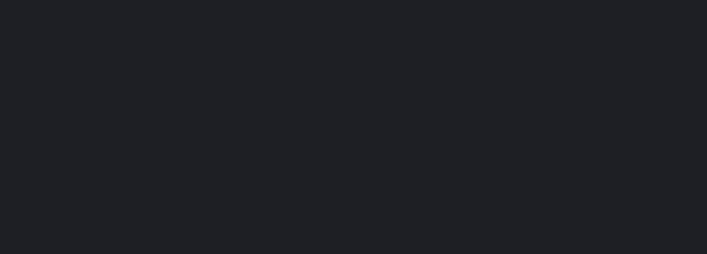
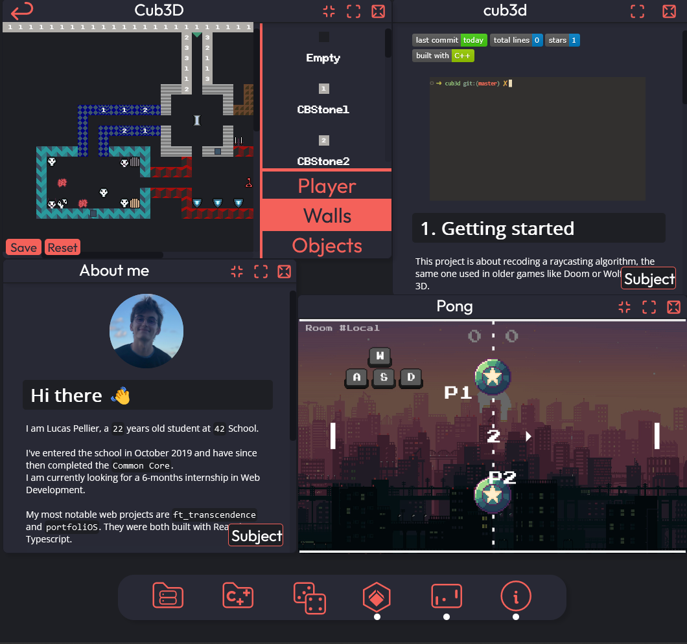

# portfoliOS

[![Last Commit][last-commit]][project-url]
[![Total Lines][total-lines]][project-url]
[![Stargazers][stars-shield]][stars-url]

[![Built With][built-with-Typescript]][project-url]
![React.js]

<br/>

</img>

## What is this ?
This is my portfolio! Inspired by modern desktop environments, portfoliOS is in itself a desktop experience.
You can open up apps which come in resizable windows.

Written in Typescript with React.

## Apps
* Server Projects: Folder containing files which are presentations of server projects I've completed at 42.
* C/C++ Projects: Folder containing files which are presentations of C/C++ projects I've completed at 42.
* Dice: Simple dice app.
* Cub3D: Revisited Cub3D (raycasting engine) with a map editor ! (zqsd to move, ae to rotate)
* Pong: Pong game directly taken from my work on ft_transcendence. Multiplayer is disabled because my portfolio has no backend.
* About me: Compilation of information about myself, including my CV.

## Usage
The website is available at the following address: https://lpellier.fr

You might want to run this build locally :
```bash
$ git clone https://github.com/lpellier/portfoliOS.git && cd portfoliOS
$ npm install
$ npm run start
```
Then visit: http://localhost:3000

</img>

## Contact
[![LinkedIn][linkedin-shield]][linkedin-url]

Lucas PELLIER - - pellierlucas@gmail.com

[built-with-Typescript]: https://img.shields.io/badge/built%20with-Typescript-green

[total-lines]: https://img.shields.io/tokei/lines/github/lpellier/portfoliOS
[last-commit]: https://img.shields.io/github/last-commit/lpellier/portfoliOS?style=flat
[project-url]: https://github.com/lpellier/portfoliOS

[stars-shield]: https://img.shields.io/github/stars/lpellier/portfoliOS.svg?style=flat
[stars-url]: https://github.com/lpellier/portfoliOS/stargazers
[linkedin-shield]: https://img.shields.io/badge/-LinkedIn-black.svg?flat&logo=linkedin&colorB=555
[linkedin-url]: https://linkedin.com/in/linkedin_username
[product-screenshot]: images/screenshot.png
[React.js]: https://img.shields.io/badge/React-20232A?style=for-the-badge&logo=react&logoColor=61DAFB
[React-url]: https://reactjs.org/ 
